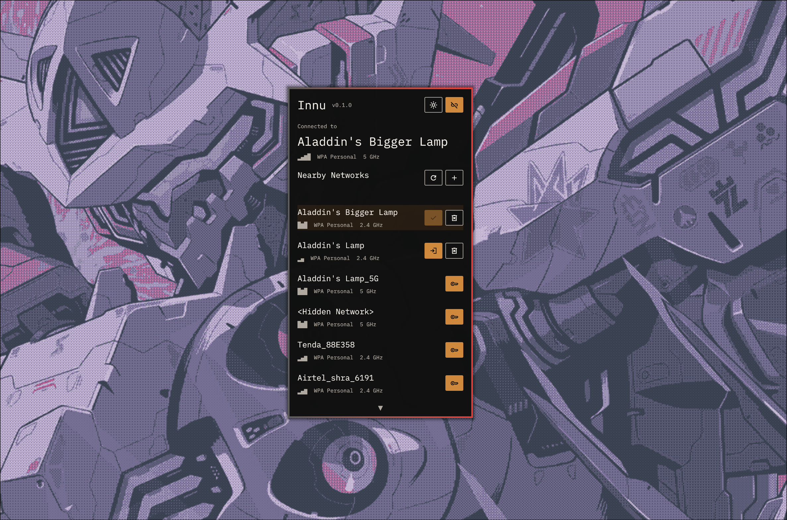

## Innu

Innu(INternet Network Utility) is a Rust-based Wi-Fi manager for Linux desktops that talks directly to NetworkManager over D-Bus and presents nearby networks in a focused `egui` interface. It is built for people who want a fast, native-feeling network picker that also looks great.


## Quick install

```bash
curl -fsSL https://raw.githubusercontent.com/gitfudge0/innu/refs/heads/main/install.sh | bash
```



### Local install from a checkout

```bash
./install.sh
```

This uses the current checked-out source tree and installs the same way.

Make sure `~/.local/bin` is on your `PATH` before launching the app from a terminal.

### Developer install

```bash
cargo build --release
```

Run it directly with:

```bash
cargo run --release
```

## Requirements

- NetworkManager running on the system
- Access to the system D-Bus
- A desktop environment with Wayland or X11 support
- Rust toolchain if you are building from source

## Usage

Launch Innu from your applications menu or from a terminal:

```bash
innu
```

## CLI

```bash
innu --help
innu --version
innu uninstall
```

`innu uninstall` removes the installed binary, desktop entry, autostart entry, and app configuration after confirmation.

## Development

Common local commands:

```bash
cargo run
cargo test
cargo build --release
```

## Contributing

Issues and pull requests are welcome. If you want to contribute, open an issue describing the bug, UX improvement, or feature idea first when the change is substantial.
